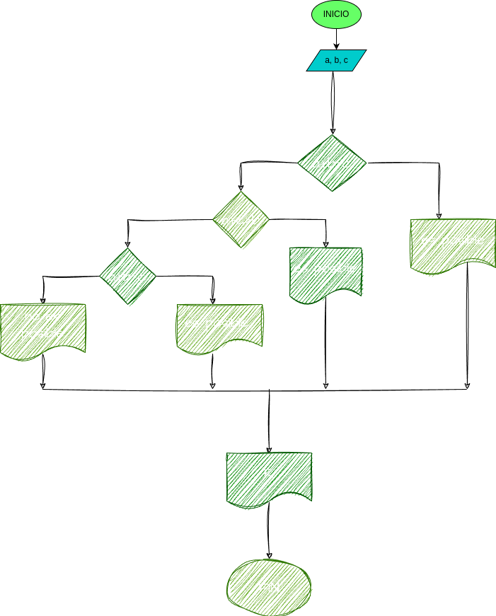

# Quiz instrucciones condicionales

### Realice el análisis, diseño y construcción para resolver el siguiente problema:

Dados tres números a, b y c, correspondientes a la longitud de los lados de una figura geométrica, determinar si pueden formar los lados de un triángulo.

# Analisis
## input
a,b,c

## processing
si la suma de dos valores es mayor al otro valor es posible formar un triangulo,de lo contrario no

## output

r (es posibl/no es posible)

## Diseño

### Diagrama de flujo
"Diagrama de flujo"

# consustruccion

